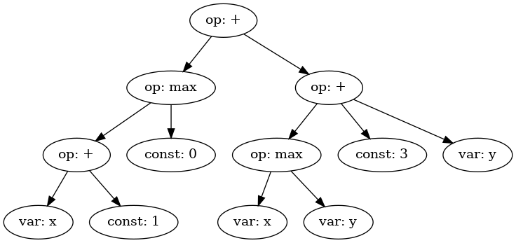

Expression Trees Notebook
-------------------------

We are going to explore the idea of expression trees and how they relate
to our tree structures and to evaluate the expression trees by rewriting the
nodes in post-order traversal.

First, let’s define our expression tree.

.. code:: ipython3

    from AlgoTree.treenode import TreeNode
    import json
    
    # Define the expression tree
    expr = TreeNode(
        {
            "value": "+",
            "type": "op",
            "children": [
                {
                    "value": "max",
                    "type": "op",
                    "children": [
                        {
                            "value": "+",
                            "type": "op",
                            "children": [
                                {"type": "var", "value": "x"},
                                {"type": "const", "value": 1},
                            ],
                        },
                        {"type": "const", "value": 0},
                    ],
                },
                {
                    "type": "op",
                    "value": "+",
                    "children": [
                        {
                            "type": "op",
                            "value": "max",
                            "children": [
                                {"type": "var", "value": "x"},
                                {"type": "var", "value": "y"},
                            ],
                        },
                        {"type": "const", "value": 3},
                        {"type": "var", "value": "y"},
                    ],
                },
            ],
        }
    )

.. code:: ipython3

    # Print the expression tree in JSON format
    print(json.dumps(expr, indent=4))

.. parsed-literal::

    {
        "value": "+",
        "type": "op",
        "children": [
            {
                "value": "max",
                "type": "op",
                "children": [
                    {
                        "value": "+",
                        "type": "op",
                        "children": [
                            {
                                "type": "var",
                                "value": "x"
                            },
                            {
                                "type": "const",
                                "value": 1
                            }
                        ]
                    },
                    {
                        "type": "const",
                        "value": 0
                    }
                ]
            },
            {
                "type": "op",
                "value": "+",
                "children": [
                    {
                        "type": "op",
                        "value": "max",
                        "children": [
                            {
                                "type": "var",
                                "value": "x"
                            },
                            {
                                "type": "var",
                                "value": "y"
                            }
                        ]
                    },
                    {
                        "type": "const",
                        "value": 3
                    },
                    {
                        "type": "var",
                        "value": "y"
                    }
                ]
            }
        ]
    }

Visualizing the Tree Structure
~~~~~~~~~~~~~~~~~~~~~~~~~~~~~~

We can use the ``TreeViz`` class to visualize the tree structure.

.. code:: ipython3

    from AlgoTree.tree_converter import TreeConverter
    from AlgoTree.tree_viz import TreeViz

.. code:: ipython3

    # Visualize the tree using TreeViz
    print(TreeViz.text(expr, node_name=lambda x: x.value))

.. parsed-literal::

    +
    ├── max
    │   ├── +
    │   │   ├── x
    │   │   └── 1
    │   └── 0
    └── +
        ├── max
        │   ├── x
        │   └── y
        ├── 3
        └── y
    

Here is what that looks like in a more convenient form.

.. code:: ipython3

    # Generate and save a visual representation of the tree
    TreeViz.image(expr, node_name=lambda n: n.type + ": " + str(n.value),
                  filename="./images/eval/tree-expr.png")

Here is an image of the local ``tree-expr.png`` file just generated:

|image0|

Post-order Traversal
~~~~~~~~~~~~~~~~~~~~

As a tree structure, ``TreeNode`` implements an interface that permits
tree traversal algorithms like depth-first pre-order and post-order
traversals.

We are going to implement a simple post-order traversal algorithm to
permit computation of the expression tree we defined earlier, ``expr``.
We see that it contains three operator types, ``+``, ``*``, and ``max``,
as well as numbers and variables.

We will provide a **closure** over all of these types so that when we
evaluate the expression in post-order, all of the types are defined for
the operations.

.. code:: ipython3

    def postorder(node, fn, ctx):
        """
        Applies function `fn` to the nodes in the tree using post-order traversal.
        :param fn: Function to apply to each node. Should accept one argument: the node.
        :param ctx: Context passed to the function.
        :return: The tree with the function `fn` applied to its nodes.
        """
        results = []
        for child in node.children:
            result = postorder(child, fn, ctx)
            if result is not None:
                results.append(result)
    
        node.children = results
        return fn(node, ctx)

The function ``postorder`` takes a tree node ``node``, a function
``fn``, and a context ``ctx``, and returns a rewritten tree.

At each node, ``postorder`` recursively calls ``fn`` on its children
before applying ``fn`` to the node itself. This is the essence of
post-order traversal.

Post-order is useful for problems where the children need to be
processed before the node itself. For example, evaluating an expression
tree, where typically the value of a node can only be computed after the
values of its children are known.

In contrast, pre-order traversal applies ``fn`` to the node before
applying it to the children. Pre-order may be useful for tasks such as
rewriting the tree in a different form, like algebraic simplification.

Expression Tree Evaluator
~~~~~~~~~~~~~~~~~~~~~~~~~

We will now design a simple expression tree evaluator, ``Eval``.

.. code:: ipython3

    from copy import deepcopy
    import uuid
    from AlgoTree.flattree_node import FlatTreeNode
    
    class Eval:
        """
        An evaluator for expressions defined by operations on types, respectively
        defined by `Eval.Op` and `Eval.Type`. The operations are a
        dictionary where the keys are the operation names and the values are
        functions that take a node and a context and return the value of the
        operation in that context.
        """
    
        Op = {
            "+": lambda x: sum(x),
            "max": lambda x: max(x),
        }
    
        Type = {
            "const": lambda node, _: node["value"],
            "var": lambda node, ctx: ctx[node["value"]],
            "op": lambda node, _: Eval.Op[node["value"]](
                [c["value"] for c in node.children]
            ),
        }
    
        def __init__(self, debug=True):
            """
            :param debug: If True, print debug information
            """
            self.debug = debug
    
        def __call__(self, expr, ctx):
            NodeType = type(expr)
            def _eval(node, ctx):
                expr_type = node["type"]
                value = Eval.Type[expr_type](node, ctx)
                result = NodeType(type="const", value=value)
                if self.debug:
                    print(f"Eval({node.payload}) -> {result.payload}")
                return result
    
            return postorder(deepcopy(expr), _eval, ctx)

To evaluate an expression tree, we need the operations to be defined for
all of the types during post-order (bottom-up) traversal. We can define
a closure over all of the types, and then use that closure to evaluate
the expression tree.

We call this closure a context. Normally, the operations and other
things are also defined in the closure, but for simplicity we will just
define the operations and provide closures over the variables.

.. code:: ipython3

    # Define the context with variable values
    ctx = {"x": 1, "y": 2, "z": 3}
    
    # Evaluate the expression tree with the context
    result = Eval(debug=True)(expr, ctx)

.. parsed-literal::

    Eval({'type': 'var', 'value': 'x'}) -> {'type': 'const', 'value': 1}
    Eval({'type': 'const', 'value': 1}) -> {'type': 'const', 'value': 1}
    Eval({'value': '+', 'type': 'op'}) -> {'type': 'const', 'value': 2}
    Eval({'type': 'const', 'value': 0}) -> {'type': 'const', 'value': 0}
    Eval({'value': 'max', 'type': 'op'}) -> {'type': 'const', 'value': 2}
    Eval({'type': 'var', 'value': 'x'}) -> {'type': 'const', 'value': 1}
    Eval({'type': 'var', 'value': 'y'}) -> {'type': 'const', 'value': 2}
    Eval({'type': 'op', 'value': 'max'}) -> {'type': 'const', 'value': 2}
    Eval({'type': 'const', 'value': 3}) -> {'type': 'const', 'value': 3}
    Eval({'type': 'var', 'value': 'y'}) -> {'type': 'const', 'value': 2}
    Eval({'type': 'op', 'value': '+'}) -> {'type': 'const', 'value': 7}
    Eval({'value': '+', 'type': 'op'}) -> {'type': 'const', 'value': 9}

.. code:: ipython3

    # Print the result of the evaluation
    print(result)

.. parsed-literal::

    TreeNode(, payload={'type': 'const', 'value': 9})

We see that we get the expected result, ``9``. Note that it is still a
tree, but it has been transformed into a so-called self-evaluating tree
expression, which in this case is a single node with no children.

We can evaluate it again, and we see that it cannot be rewritten
further. We call this state a **normal form**. Essentially, we can think
of the tree as a program that computes a value, and the normal form is
the result of running the program.

.. code:: ipython3

    # Ensure the evaluated result is in its normal form
    assert Eval(debug=False)(result, ctx).value == result.value

Converting to FlatTree
~~~~~~~~~~~~~~~~~~~~~~

Let’s convert the tree to a ``FlatTree`` and perform the same
evaluation.

.. code:: ipython3

    # Convert TreeNode to FlatTreeNode
    flat_expr = TreeConverter.convert(source_node=expr, target_type=FlatTreeNode, extract=lambda n: n.payload)
    print(json.dumps(flat_expr.tree, indent=4))

.. parsed-literal::

    {
        "946dbd0a-0be3-408b-949a-c45d00867b9e": {
            "value": "+",
            "type": "op"
        },
        "cf0681b3-431d-4d4c-82c9-fb2ef7550460": {
            "value": "max",
            "type": "op",
            "parent": "946dbd0a-0be3-408b-949a-c45d00867b9e"
        },
        "71f23b14-659a-4f0f-9288-d5586d202bc6": {
            "value": "+",
            "type": "op",
            "parent": "cf0681b3-431d-4d4c-82c9-fb2ef7550460"
        },
        "be971f83-c379-431d-a0ee-31c0892fb385": {
            "type": "var",
            "value": "x",
            "parent": "71f23b14-659a-4f0f-9288-d5586d202bc6"
        },
        "de8fd66f-1fbb-413e-827a-54fc091cf7f6": {
            "type": "const",
            "value": 1,
            "parent": "71f23b14-659a-4f0f-9288-d5586d202bc6"
        },
        "677da881-a8a8-4996-8e47-0f1cd53771af": {
            "type": "const",
            "value": 0,
            "parent": "cf0681b3-431d-4d4c-82c9-fb2ef7550460"
        },
        "fd1c676e-d13a-4e16-a893-c99fd52af980": {
            "type": "op",
            "value": "+",
            "parent": "946dbd0a-0be3-408b-949a-c45d00867b9e"
        },
        "73e998b5-701c-4c59-9875-cc3befd88d26": {
            "type": "op",
            "value": "max",
            "parent": "fd1c676e-d13a-4e16-a893-c99fd52af980"
        },
        "a17dd9de-b015-4e5e-be7c-290ec8b26651": {
            "type": "var",
            "value": "x",
            "parent": "73e998b5-701c-4c59-9875-cc3befd88d26"
        },
        "deffff04-4433-43a8-828b-ee209df4f77f": {
            "type": "var",
            "value": "y",
            "parent": "73e998b5-701c-4c59-9875-cc3befd88d26"
        },
        "df31efa0-1aac-4c90-b752-4f3d77eba747": {
            "type": "const",
            "value": 3,
            "parent": "fd1c676e-d13a-4e16-a893-c99fd52af980"
        },
        "1c3e10ae-0692-4644-a001-8db774d0458a": {
            "type": "var",
            "value": "y",
            "parent": "fd1c676e-d13a-4e16-a893-c99fd52af980"
        }
    }

.. code:: ipython3

    # Evaluate the flat tree expression
    result = Eval(debug=True)(flat_expr, ctx)
    # Print the result of the evaluation
    print(result)
    # Print the underlying flat tree structure
    print(json.dumps(result.tree, indent=4))

.. parsed-literal::

    Eval({'type': 'var', 'value': 'x'}) -> {'type': 'const', 'value': 1}
    Eval({'type': 'const', 'value': 1}) -> {'type': 'const', 'value': 1}
    Eval({'value': '+', 'type': 'op'}) -> {'type': 'const', 'value': 2}
    Eval({'type': 'const', 'value': 0}) -> {'type': 'const', 'value': 0}
    Eval({'value': 'max', 'type': 'op'}) -> {'type': 'const', 'value': 2}
    Eval({'type': 'var', 'value': 'x'}) -> {'type': 'const', 'value': 1}
    Eval({'type': 'var', 'value': 'y'}) -> {'type': 'const', 'value': 2}
    Eval({'type': 'op', 'value': 'max'}) -> {'type': 'const', 'value': 2}
    Eval({'type': 'const', 'value': 3}) -> {'type': 'const', 'value': 3}
    Eval({'type': 'var', 'value': 'y'}) -> {'type': 'const', 'value': 2}
    Eval({'type': 'op', 'value': '+'}) -> {'type': 'const', 'value': 7}
    Eval({'value': '+', 'type': 'op'}) -> {'type': 'const', 'value': 9}
    FlatTreeNode(name=c6482f6a-13b5-442a-922c-bbaa0c291378, parent=None, payload={'type': 'const', 'value': 9})

The ``FlatTree`` structure is a different kind of tree structure that is
more convenient for relatively flatter data, like conversation logs. It
is a tree structure that is flattened into a dictionary of key-value
pairs, where the value is also a dictionary. This value dictionary
optionally contains the parent key, and if not then it is a child of a
so-called logical root. However, as can be seen in this example, the
``FlatTree`` structure can also be used to represent more complex tree
structures like expression trees.

Handling Undefined Variables
~~~~~~~~~~~~~~~~~~~~~~~~~~~~

What happens when we change the context so that not every variable is
defined?

.. code:: ipython3

    # Define an incomplete context with missing variable values
    open_ctx = {
        "x": 1,
        # 'y': 2,  # 'y' is not defined in this context
        "z": 3,
    }
    
    # Try evaluating the expression tree with the incomplete context
    try:
        Eval(debug=True)(expr, open_ctx)
    except KeyError as e:
        print(f"Error: {e}")

.. parsed-literal::

    Eval({'type': 'var', 'value': 'x'}) -> {'type': 'const', 'value': 1}
    Eval({'type': 'const', 'value': 1}) -> {'type': 'const', 'value': 1}
    Eval({'value': '+', 'type': 'op'}) -> {'type': 'const', 'value': 2}
    Eval({'type': 'const', 'value': 0}) -> {'type': 'const', 'value': 0}
    Eval({'value': 'max', 'type': 'op'}) -> {'type': 'const', 'value': 2}
    Eval({'type': 'var', 'value': 'x'}) -> {'type': 'const', 'value': 1}
    Error: 'y'

We see that we get an error. Our operations in ``Eval.Op`` are not
defined over undefined variables.

We would run into a similar problem if we used pre-order traversal
instead of post-order. In pre-order traversal, we would try to evaluate
the parent node (say, an operation) before we had evaluated its
children, which would result in an error. Our defined operations only
work over numbers (type ``const``), so we need to evaluate the
non-``const`` expressions first in order for our operations to be
defined for them.

Post-order vs. Pre-order Traversal
~~~~~~~~~~~~~~~~~~~~~~~~~~~~~~~~~~

Post-order traversal is good for things like evaluating expressions,
where you need to evaluate the children before you can evaluate the
parent.

Pre-order traversal is good for things like rewriting trees from the top
down, but your rewrite rules need to be defined in terms of
sub-expression trees. So, for example, you might have a complex
expression and seek to rewrite it into a simpler form. This is an
example of a **rewrite system**. A rewrite system is a set of rules that
transform expressions into other expressions. For instance, suppose that
we add a ``0`` to a variable ``x`` in the expression tree. We know that
``x + 0`` is the same as ``x``, so we could add a rewrite rule that maps
the sub-tree ``(+ x 0)`` to ``x``. We could add many rewrite rules to
implement, for instance, algebraic simplification (``simplify``), or
implement a compiler (``compile``) that translates the tree into a
different form that could be evaluated by a different set of rewrite
rules. Or, the compiler could be an optimizing compiler that rewrites
the tree into a form that is more efficient to evaluate, like replacing
a multiplication by a power of two with a shift or getting rid of no-op
operations like adding zero.
