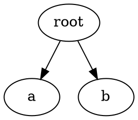
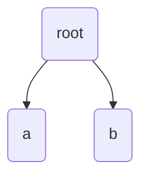

# Exporting Trees

AlgoTree can export trees to various formats for visualization, serialization, and integration.

## Quick Export

Use `export_tree()` for simple exports:

```python
from AlgoTree import Node, export_tree

tree = Node("root", Node("a"), Node("b"))

# Export to various formats
json_str = export_tree(tree, "json")
dot_str = export_tree(tree, "graphviz")
mermaid_str = export_tree(tree, "mermaid")
yaml_str = export_tree(tree, "yaml")
xml_str = export_tree(tree, "xml")
html_str = export_tree(tree, "html")
```

## Saving to Files

Use `save_tree()` with format auto-detection:

```python
from AlgoTree import save_tree

# Format detected from extension
save_tree(tree, "tree.json")      # JSON
save_tree(tree, "tree.dot")       # GraphViz
save_tree(tree, "tree.mmd")       # Mermaid
save_tree(tree, "tree.yaml")      # YAML
save_tree(tree, "tree.xml")       # XML
save_tree(tree, "tree.html")      # HTML

# Explicit format
save_tree(tree, "output.txt", format="ascii")
```

## Export Formats

### JSON

```python
from AlgoTree import export_tree

json_str = export_tree(tree, "json", indent=2)
```

Output:
```json
{
  "name": "root",
  "children": [
    {"name": "a", "children": []},
    {"name": "b", "children": []}
  ]
}
```

### ASCII/Unicode Tree

```python
# ASCII
ascii_tree = export_tree(tree, "ascii")

# Unicode (box drawing characters)
unicode_tree = export_tree(tree, "unicode")
```

Output:
```
root
├── a
└── b
```

### GraphViz DOT

```python
dot = export_tree(tree, "graphviz", name="MyTree")
```

Output:


With custom attributes:

```python
from AlgoTree.exporters import TreeExporter

dot = TreeExporter.to_graphviz(
    tree,
    name="FileTree",
    node_attr=lambda n: {
        "label": f"{n.name}\\n{n.get('size', '')}",
        "shape": "box" if n.is_leaf else "ellipse"
    },
    edge_attr=lambda parent, child: {
        "style": "dashed" if child.get("optional") else "solid"
    },
    graph_attr={"rankdir": "LR"}
)
```

### Mermaid

```python
mermaid = export_tree(tree, "mermaid")
```

Output:


With options:

```python
from AlgoTree.exporters import TreeExporter

mermaid = TreeExporter.to_mermaid(
    tree,
    direction="LR",      # LR, RL, TB, TD, BT
    node_shape="round",  # round, square, circle, rhombus, stadium
    node_text=lambda n: f"{n.name}<br/>{n.get('type', '')}"
)
```

### YAML

```python
yaml = export_tree(tree, "yaml")
```

Output:
```yaml
- name: root
  children:
    - name: a
    - name: b
```

### XML

```python
xml = export_tree(tree, "xml")
```

Output:
```xml
<?xml version="1.0" encoding="UTF-8"?>
<tree>
  <node name="root">
    <node name="a" />
    <node name="b" />
  </node>
</tree>
```

### HTML

Interactive HTML with collapsible nodes:

```python
from AlgoTree.exporters import TreeExporter

html = TreeExporter.to_html(
    tree,
    include_styles=True,
    collapsible=True
)
```

### Flat/Graph Format

Flat dictionary format for graph interoperability:

```python
flat = export_tree(tree, "flat")
```

Output:
```json
{
  "root": {
    ".name": "root",
    ".children": ["a", "b"]
  },
  "root/a": {
    ".name": "a",
    ".children": []
  },
  "root/b": {
    ".name": "b",
    ".children": []
  }
}
```

## Pretty Printing

For console output, use `pretty_tree()`:

```python
from AlgoTree import pretty_tree

print(pretty_tree(tree))
```

Output:
```
root
├── a
└── b
```

## TreeExporter Class

Direct access to exporters:

```python
from AlgoTree.exporters import TreeExporter

# Dictionary
d = TreeExporter.to_dict(tree)

# JSON
json_str = TreeExporter.to_json(tree, indent=2)

# ASCII/Unicode
ascii_str = TreeExporter.to_ascii(tree, style="ascii")
unicode_str = TreeExporter.to_unicode(tree)

# GraphViz
dot_str = TreeExporter.to_graphviz(tree, name="MyTree")

# Mermaid
mermaid_str = TreeExporter.to_mermaid(tree, direction="TD")

# YAML
yaml_str = TreeExporter.to_yaml(tree, indent=2)

# XML
xml_str = TreeExporter.to_xml(tree, root_tag="tree")

# HTML
html_str = TreeExporter.to_html(tree, collapsible=True)

# Flat format
flat_str = TreeExporter.to_flat(tree)
```

## Format Reference

| Format | Extension | Description |
|--------|-----------|-------------|
| `json` | `.json` | JSON with nested structure |
| `flat`/`graph` | - | Flat dictionary format |
| `ascii` | `.txt` | ASCII art tree |
| `unicode` | - | Unicode box-drawing tree |
| `graphviz`/`dot` | `.dot`, `.gv` | GraphViz DOT format |
| `mermaid` | `.mmd` | Mermaid diagram |
| `yaml` | `.yaml`, `.yml` | YAML format |
| `xml` | `.xml` | XML format |
| `html` | `.html` | Interactive HTML |
