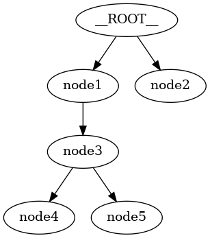

FlatTree
========

The `FlatTree` class represents a tree using a flat dictionary structure where each node has a unique key and an optional 'parent' key to reference its parent node. This class provides a view adapter for dict/JSON data of a particular format.

Tree Data Format
----------------

A `FlatTree` is represented using a dictionary, where each key is a unique node identifier, and the value is another dictionary containing node data and an optional 'parent' key indicating the parent node.

.. code-block:: json

    {
      "<node_key>": {
          "parent": "<parent_node_key>",  // Parent node key (optional)
          <key>: "<value>"  // Node payload (optional key-value pairs)
      }
      // ... more node key-value pairs
    }

Example Tree Data:

.. code-block:: json

    {
      "node1": {
        "data": "Some data for node1"
      },
      "node2": {
        "data": "Some data for node2"
      },
      "node3": {
        "parent": "node1",
        "data": "Some data for node3"
      },
      "node4": {
        "parent": "node3",
        "data": "Some data for node4"
      },
      "node5": {
        "parent": "node3",
        "data": "Some data for node5"
      }
    }

Theoretical Background
----------------------

Trees are hierarchical data structures consisting of nodes, where each node has a parent and potentially many children. Trees are used in various domains such as databases, file systems, and network routing. They are particularly useful for representing data with a nested or hierarchical nature.

Tree Terminology

- **Node:** A structure that contains data and references to its parent. A tree is a collection of nodes related by parent-child relationships.
- **Root:** The top node of a tree.
- **Leaf:** A node with no children.

Proxy Objects and Views
^^^^^^^^^^^^^^^^^^^^^^^

In computer science, a proxy object is an object that acts as an intermediary for another object. The proxy can control access to the original object, providing additional functionality such as validation, lazy loading, or caching. This is a common design pattern used to create a level of indirection.

A view in this context is an abstraction that provides a different perspective or representation of the underlying data. For example, a view can present a flat dictionary as a hierarchical tree structure.

`FlatTreeNode` Proxies
""""""""""""""""""""""

The `FlatTreeNode` is a proxy class for providing a node-centric view of `FlatTree`
objects. It allows you to treat nodes as first-class objects while maintaining
the underlying flat dictionary structure. You do not even need to be aware
of `FlatTree` objects, since you can create and manipulate nodes directly,
but these operations are reflected in the underlying `FlatTree`, which may
be accessed if needed using the `tree` attribute.

Key Features:

- **Encapsulation:** Provides methods to manipulate individual nodes.
- **Abstraction:** Hides the complexity of the flat dictionary structure, presenting a more intuitive tree-like interface.
- **Flexibility:** Allows you to work with sub-trees and individual nodes seamlessly.

Logical Root Node
^^^^^^^^^^^^^^^^^

In `FlatTree`, the concept of a logical root node simplifies the representation and manipulation of trees.
The logical root node, denoted as `__ROOT__`, is not a physical node in the tree but a conceptual node that serves as the parent of all nodes without an explicit parent reference.
This approach ensures that a forest (multiple trees) can be represented as a single tree structure.

Benefits of a Logical Root Node:

- **Unified Structure:** Converts a forest into a single tree, simplifying operations and visualizations.
- **Consistency:** Ensures all nodes are part of a single hierarchy, making traversal and manipulation more straightforward.
- **Flexibility:** Allows easy addition of new nodes without worrying about their initial placement in the hierarchy.

`FlatTree` Class
----------------

The `FlatTree` class provides a flexible way to work with tree structures using a flat dictionary format. It offers various methods for manipulating and visualizing trees.

Initializing a FlatTree
^^^^^^^^^^^^^^^^^^^^^^^

You can initialize a `FlatTree` with a dictionary representing the tree data.

.. code-block:: python

    import treekit as tk

    tree_data = {
        "node1": {
            "data": "Some data for node1"
        },
        "node2": {
            "data": "Some data for node2"
        },
        "node3": {
            "parent": "node1",
            "data": "Some data for node3"
        },
        "node4": {
            "parent": "node3",
            "data": "Some data for node4"
        },
        "node5": {
            "parent": "node3",
            "data": "Some data for node5"
        }
    }

    tree = tk.FlatTree(tree_data)
    print(json.dumps(tree, indent=2))

Expected Output:

.. code-block:: json

    {
      "node1": {
        "data": "Some data for node1"
      },
      "node2": {
        "data": "Some data for node2"
      },
      "node3": {
        "parent": "node1",
        "data": "Some data for node3"
      },
      "node4": {
        "parent": "node3",
        "data": "Some data for node4"
      },
      "node5": {
        "parent": "node3",
        "data": "Some data for node5"
      }
    }

Visualizing the Tree
^^^^^^^^^^^^^^^^^^^^

You can visualize the tree using the `TreeViz` class.

Text Visualization
""""""""""""""""""

.. code-block:: python

    from treekit.tree_viz import TreeViz
    print(TreeViz.text(tree))

Expected Output:

.. code-block:: text

    __ROOT__
    ├── node1
    │   └── node3
    │       ├── node4
    │       └── node5
    └── node2

Image Visualization
"""""""""""""""""""

.. code-block:: python

    TreeViz.image(tree, "./images/tree.png")

Here is the image (`./images/tree.png` from above) of the tree:

Manipulating the Tree
^^^^^^^^^^^^^^^^^^^^^

Adding a Child Node
"""""""""""""""""""

.. code-block:: python

    child = tree.get_root().add_child(name="node36", data="Some data for node36")
    print(child)

Expected Output:

.. code-block:: text

    FlatTreeNode(name=node36, parent=__ROOT__, payload={'data': 'Some data for node36'})

Viewing Sub-Trees
^^^^^^^^^^^^^^^^^

You can work with sub-trees rooted at any node.

.. code-block:: python

    print(TreeViz.text(tree.node("node3")))

Expected Output:

.. code-block:: text

    node3
    ├── node4
    └── node5

Validating the Tree
^^^^^^^^^^^^^^^^^^^

Ensures that all keys are unique and that parent references are valid.

.. code-block:: python

    tree.check_valid()

Detaching and Pruning Nodes
^^^^^^^^^^^^^^^^^^^^^^^^^^^

You can detach nodes, which sets their parent to a special key indicating they are detached, and prune detached nodes to remove them from the tree.

Detaching a Node
""""""""""""""""

.. code-block:: python

    tree.node("node36").detach()
    TreeViz.image(tree, "./images/full-tree-post-detach-node-36.png")

Here is the tree with the detached node `node36`:

.. image:: ./images/full-tree-post-detach-node-36.png

Pruning Detached Nodes
""""""""""""""""""""""

.. code-block:: python

    tree.prune(tree.node("node36"))

Handling Errors
^^^^^^^^^^^^^^^

Invalid Parent Reference
""""""""""""""""""""""""

Attempting to create a tree with an invalid parent reference will raise an error.

.. code-block:: python

    try:
        invalid_tree = tk.FlatTree({
            "node1": {
                "parent": "non_existent_parent",
                "data": "Some data for node1"
            }})
        print(TreeViz.text(invalid_tree))
        invalid_tree.check_valid()
    except KeyError as e:
        print(e)

Expected Output:

.. code-block:: text

    Node('/__ROOT__')
    Parent node non-existent: 'non_existent_parent'

Cycle Detection
"""""""""""""""

The `FlatTree` class checks for cycles in the tree and raises an error if a cycle is detected.

.. code-block:: python

    try:
        cycle_tree_data = {
            "node0": { "data": "Some data for node0"},
            "node1": {"parent": "node2", "data": "Some data for node1"},
            "node2": {"parent": "node3", "data": "Some data for node2"},
            "node3": {"parent": "node1", "data": "Some data for node3"},
            "node4": {"parent": "node0", "data": "Some data for node4"}
        }
        cycle_tree = tk.FlatTree(cycle_tree_data)
        cycle_tree.check_valid()
    except ValueError as e:
        print(e)

Expected Output:

.. code-block:: text

    Node('/__ROOT__')
    └── Node('/__ROOT__/node0', data='Some data for node0')
        └── Node('/__ROOT__/node0/node4', data='Some data for node4')

    Cycle detected: {'node2', 'node3', 'node1'}

Tree Conversions
----------------

You can convert between different tree representations, such as `FlatTree`, `TreeNode`, and `anytree.Node` objects.
However, any tree-like that implements the node interface can be converted to any other tree-like that implements the node interface.
We provide a `TreeConverter` class to facilitate these conversions.

Converting to `TreeNode`
^^^^^^^^^^^^^^^^^^^^^^^^

.. code-block:: python

    import treekit.tree_converter as tc
    new_tree = tc.TreeConverter.convert(tree, target_type=tk.TreeNode)
    print(type(new_tree))
    print(TreeViz.text(new_tree))

Expected Output:

.. code-block:: text

    <class 'treekit.treenode.TreeNode'>

    __ROOT__
    ├── node1
    │   ├── node3
    │   │   ├── node4
    │   │   └── node5
    └── node2

Conclusion
----------

The `FlatTree` class provides a flexible and powerful way to represent and manipulate tree structures using a flat dictionary format. With methods for adding, detaching, pruning, and visualizing nodes, `FlatTree` can handle various tree-related tasks efficiently. This tutorial has covered the basic and advanced usage of the class, demonstrating its capabilities and versatility.

For more detailed information and code implementation, refer to the [GitHub repository](https://github.com/queelius/treekit).
