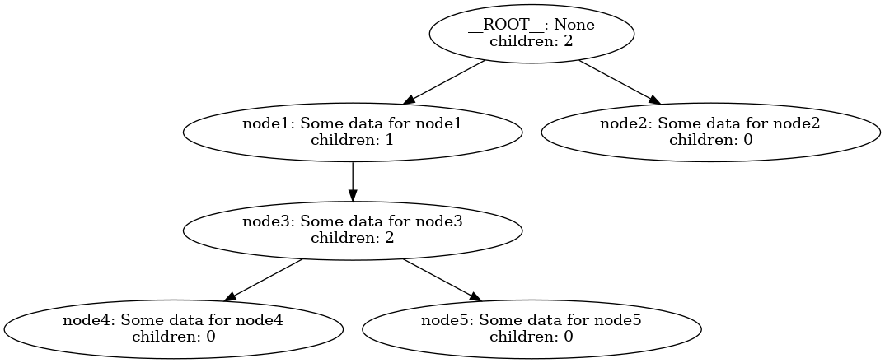
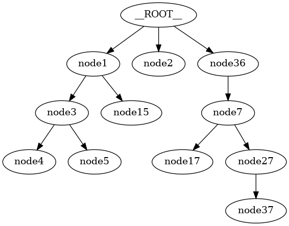
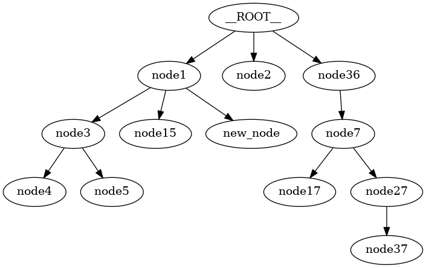

``FlatTree Notebook``
=====================

In this notebook, we explore the ``FlatTree`` data structure, which is a
tree with a flat memory layout. This data structure is useful when we
want to store a tree in a contiguous memory block. We will implement the
``FlatTree`` data structure and demonstrate how to perform various
operations on it.

We also demonstrate the ``FlatTreeNode`` proxy class, which allows us to
access the nodes of the ``FlatTree`` using a tree-like interface.

Let’s load the required libraries and create a ``FlatTree`` data
structure using the node interface.

.. code:: ipython3

    from treekit.flattree_node import FlatTreeNode
    from treekit.tree_viz import TreeViz
    from treekit.tree_converter import TreeConverter
    from treekit.flattree import FlatTree
    import json
    
    root = FlatTreeNode(name="root", data=0)
    node1 = FlatTreeNode(name="node1", parent=root, data=1)
    node2 = FlatTreeNode(name="node2", parent=root, data=2)
    node3 = FlatTreeNode(name="node3", parent=root, data=3)
    node4 = FlatTreeNode(name="node4", parent=node3, data=4)
    node5 = FlatTreeNode(name="node5", parent=node3, data=5)
    node6 = FlatTreeNode(name="node6", parent=node3, data=6)
    node7 = FlatTreeNode(name="node7", parent=node3, data=7)
    node8 = FlatTreeNode(name="node8", parent=node3, data=8)
    node9 = FlatTreeNode(name="node9", parent=node6, data=9)
    tree = root._tree
    nodes = [
        tree.root,
        root,
        node1,
        node2,
        node3,
        node4,
        node5,
        node6,
        node7,
        node8,
        node9,
    ]
    
    for node in nodes:
        try:
            print(node.name, node.payload, node.parent)
        except ValueError as e:
            print(f"ValueError: {e}")
        except KeyError as e:
            print(f"KeyError: {e}")
        print()

.. parsed-literal::

    __ROOT__ {} None
    
    root {'data': 0} None
    
    node1 {'data': 1} FlatTreeNode(name=root, parent=None, payload={'data': 0})
    
    node2 {'data': 2} FlatTreeNode(name=root, parent=None, payload={'data': 0})
    
    node3 {'data': 3} FlatTreeNode(name=root, parent=None, payload={'data': 0})
    
    node4 {'data': 4} FlatTreeNode(name=node3, parent=root, payload={'data': 3})
    
    node5 {'data': 5} FlatTreeNode(name=node3, parent=root, payload={'data': 3})
    
    node6 {'data': 6} FlatTreeNode(name=node3, parent=root, payload={'data': 3})
    
    node7 {'data': 7} FlatTreeNode(name=node3, parent=root, payload={'data': 3})
    
    node8 {'data': 8} FlatTreeNode(name=node3, parent=root, payload={'data': 3})
    
    node9 {'data': 9} FlatTreeNode(name=node6, parent=node3, payload={'data': 6})
    

Let’s do something similar, but using the ``FlatTree``\ ’s ``dict`` or
``json`` constructor. This is more direct and makes it explicit what
data the tree is providing a *view* of. After all, the ``FlatTree`` is
itself just a ``dict`` of a particular shape.

.. code:: ipython3

    tree_data = {
        "node1": {
            # "parent": None,
            "data": "Some data for node1",
            "more": "Some more data for node1",
        },
        "node2": {
            # "parent": "node1",
            "data": "Some data for node2"
        },
        "node3": {
            "parent": "node1",
            "data": "Some data for node3",
            "test": "Some test data for node3",
        },
        "node4": {"parent": "node3", "data": "Some data for node4"},
        "node5": {"parent": "node3", "data": "Some data for node5"},
    }
    print(json.dumps(tree_data, indent=2))

.. parsed-literal::

    {
      "node1": {
        "data": "Some data for node1",
        "more": "Some more data for node1"
      },
      "node2": {
        "data": "Some data for node2"
      },
      "node3": {
        "parent": "node1",
        "data": "Some data for node3",
        "test": "Some test data for node3"
      },
      "node4": {
        "parent": "node3",
        "data": "Some data for node4"
      },
      "node5": {
        "parent": "node3",
        "data": "Some data for node5"
      }
    }

.. code:: ipython3

    # load a tree from tree_data
    tree = FlatTree(tree_data)
    print(json.dumps(tree, indent=2))

.. parsed-literal::

    {
      "node1": {
        "data": "Some data for node1",
        "more": "Some more data for node1"
      },
      "node2": {
        "data": "Some data for node2"
      },
      "node3": {
        "parent": "node1",
        "data": "Some data for node3",
        "test": "Some test data for node3"
      },
      "node4": {
        "parent": "node3",
        "data": "Some data for node4"
      },
      "node5": {
        "parent": "node3",
        "data": "Some data for node5"
      }
    }

.. code:: ipython3

    test = FlatTreeNode(name="real_root", value="test")
    print(json.dumps(test.tree, indent=2))
    print(TreeViz.text(test))

.. parsed-literal::

    {
      "real_root": {
        "value": "test"
      }
    }
    real_root
    

.. code:: ipython3

    test.add_child(name="test_child", value="test_child_value")
    child2 = test.add_child(name="test_child2", value="test_child_value2")
    child2.add_child(name="test_child3", value="test_child_value3")
    
    print(json.dumps(test.tree, indent=2))

.. parsed-literal::

    {
      "real_root": {
        "value": "test"
      },
      "test_child": {
        "value": "test_child_value",
        "parent": "real_root"
      },
      "test_child2": {
        "value": "test_child_value2",
        "parent": "real_root"
      },
      "test_child3": {
        "value": "test_child_value3",
        "parent": "test_child2"
      }
    }

.. code:: ipython3

    child2_test = test.tree.node("test_child2")
    print(child2_test, "\n", child2)
    assert child2_test == child2
    child3_test = test.tree.node("test_child3")
    assert child3_test != child2
    print(child3_test, "\n", child2)

.. parsed-literal::

    FlatTreeNode(name=test_child2, parent=real_root, payload={'value': 'test_child_value2'}) 
     FlatTreeNode(name=test_child2, parent=real_root, payload={'value': 'test_child_value2'})
    FlatTreeNode(name=test_child3, parent=test_child2, payload={'value': 'test_child_value3'}) 
     FlatTreeNode(name=test_child2, parent=real_root, payload={'value': 'test_child_value2'})

.. code:: ipython3

    def pretty_print(node, depth=0):
        if depth != 0:
            print("    " * depth, "|")
            print("    " * depth, "+", "-" * depth, end=" ")
        print(node.name)
        for child in node.children:
            pretty_print(child, depth + 1)
    
    
    pretty_print(tree.root)
    pretty_print(test.tree.root)

.. parsed-literal::

    __ROOT__
         |
         + - node1
             |
             + -- node3
                 |
                 + --- node4
                 |
                 + --- node5
         |
         + - node2
    __ROOT__
         |
         + - real_root
             |
             + -- test_child
             |
             + -- test_child2
                 |
                 + --- test_child3

For now on, when viewing trees, we use the ``TreeViz`` class to
visualize the trees. It has a ``text`` and ``image`` method to display
the tree in text and image format respectively.

.. code:: ipython3

    from anytree import Node
    
    anytree = TreeConverter.convert(tree.node("node1"), target_type=Node)

.. code:: ipython3

    print(TreeViz.text(anytree))

.. parsed-literal::

    node1
    └── node3
        ├── node4
        └── node5
    

.. code:: ipython3

    print(anytree.children[0].depth)
    print(anytree.children[0].path)
    print(anytree.children[0].ancestors)
    print(anytree.children[0].siblings)
    print(anytree.is_root)

.. parsed-literal::

    1
    (Node('/node1', data='Some data for node1', more='Some more data for node1'), Node('/node1/node3', data='Some data for node3', test='Some test data for node3'))
    (Node('/node1', data='Some data for node1', more='Some more data for node1'),)
    ()
    True

.. code:: ipython3

    TreeViz.image(anytree, "images/anytree.png")

Here is the image (``anytree.png`` from above) of the tree:

.. figure:: images/anytree.png
   :alt: tree

   tree

We may want to show different or more information in the image. In order
to do so, firs we shold convert ``tree`` to any ``anytree.Node`` that
carries more information.

.. code:: ipython3

    def detailed_node_info(node):
        return {"data": node.payload["data"] if "data" in node.payload else "None"}
    
    
    anytree2 = TreeConverter.convert(
        tree.root,
        Node,
        node_name=lambda node: node.name,
        extract=detailed_node_info,
    )
    
    TreeViz.image(
        anytree2,
        "images/anytree-more.png",
        node_name=lambda node: node.name
        + ": "
        + node.data
        + "\nchildren: "
        + str(len(node.children)),
    )

Here is the image:

   tree

The ``FlatTree`` class provides a **view** of a ``dict`` object as a
tree. We do not modify the ``dict`` passed into it (and you can create a
dict through the ``FlatTree`` API).

The ``FlatTree`` class has a number of methods and properties to help
you navigate the tree. A particular aspect of the ``FlatTree`` class is
that it unifies any ``dict`` object into a tree structure. The keys are
the node names and the values are the node values. If the value has no
parent, it is a child of a ``LOGICAL_ROOT`` node that is computed lazily
on demand (and is not a part of the actual underlying ``dict`` object).
In this way, every dict is a tree, and every tree is a dict, with the
exception that undefined behavior may result if the ``dict`` has keys
that map to values in which a ``parent`` key is defined but results in a
cycle or a node that is not in the ``dict``. In this case, it will still
try to work with it, but the behavior is undefined. You can call
``FlatTree.check_valid`` to check if the tree is in a valid state.

Since it’s just a view of a ``dict`` we have all the normal operations
on it that we would have on a ``dict`` object.

We can also use the ``FlatTree`` class to visualize sub-trees rooted at
some node.

By default, the ``FlatTree`` conceptually represents as a whole the
logical root of the tree. However, we have ``FlatTree.ProxyNode``
objects that can be used to represent any node in the tree, and supports
the same API as the ``FlatTree`` class itself.

.. code:: ipython3

    print(TreeViz.text(tree.node("node3")))

.. parsed-literal::

    node3
    ├── node4
    └── node5
    

.. code:: ipython3

    print(tree["node2"])
    node3 = tree.node("node3")
    print(node3)
    print(node3["parent"])
    print(node3.children)

.. parsed-literal::

    {'data': 'Some data for node2'}
    FlatTreeNode(name=node3, parent=node1, payload={'data': 'Some data for node3', 'test': 'Some test data for node3'})
    node1
    [FlatTreeNode(name=node4, parent=node3, payload={'data': 'Some data for node4'}), FlatTreeNode(name=node5, parent=node3, payload={'data': 'Some data for node5'})]

We show that it’s easy to regenerate any JSON files that may have been
used to generate the FlatTree ‘tree’. So, JSON is a good format for
storing and transmitting trees. And, of course, ``FlatTree`` *is* a
dictionary. Of course, if we store an object that has no serializable
representation, it cannot be stored in JSON.

.. code:: ipython3

    print(json.dumps(tree, indent=2) == json.dumps(tree_data, indent=2))

.. parsed-literal::

    True

.. code:: ipython3

    # let's create a tree from a dict that cannot be serialized to json
    non_serializable_tree_data = {
        "node1": {
            # data maps tp a function that cannot be serialized
            "data": lambda x: 2 * x**3
            + 3 * x**2
            + 4 * x
            + 5
        }
    }
    
    non_serializable_tree = FlatTree(non_serializable_tree_data)
    print(non_serializable_tree)
    
    try:
        json.dumps(non_serializable_tree, indent=2)
    except TypeError as e:
        print(e)

.. parsed-literal::

    {'node1': {'data': <function <lambda> at 0x7f7324d2c790>}}
    Object of type function is not JSON serializable

.. code:: ipython3

    child = tree.root.add_child(name="node36", data="Some data for node36")
    print(child)

.. parsed-literal::

    FlatTreeNode(name=node36, parent=None, payload={'data': 'Some data for node36'})

.. code:: ipython3

    tree.node("node1").add_child(name="node15", data="Some data for node15")
    print(TreeViz.text(tree.root))

.. parsed-literal::

    __ROOT__
    ├── node1
    │   ├── node3
    │   │   ├── node4
    │   │   └── node5
    │   └── node15
    ├── node2
    └── node36
    

If we try too add a non-unique node key to the tree, we will get a
``KeyError``.

.. code:: ipython3

    try:
        child2 = tree.node("node1").add_child(
            name="node2", data="Some data for node2!!!"
        )
    except KeyError as e:
        print(e)

.. parsed-literal::

    'key already exists in the tree: node2'

Let’s add some more nodes.

.. code:: ipython3

    child7 = child.add_child(name="node7", data="Some data for node7")
    child7.add_child(name="node17", data="Some data for node17")
    child7.add_child(name="node27", data="Some data for node27").add_child(
        name="node37", data="Some data for node37"
    )
    print(TreeViz.text(TreeConverter.convert(child7, Node), node_name=lambda n: n))

.. parsed-literal::

    Node('/node7', data='Some data for node7')
    ├── Node('/node7/node17', data='Some data for node17')
    └── Node('/node7/node27', data='Some data for node27')
        └── Node('/node7/node27/node37', data='Some data for node37')
    

.. code:: ipython3

    FlatTree.check_valid(tree)

Let’s view the full tree with the ``TreeViz.image`` method.

.. code:: ipython3

    TreeViz.image(tree.root, "images/big_tree.png")

Here’s the tree:

   big_tree

We can see that the underlying tree that the child is a member of has
been appropriately modified:

We also support conversions to and from ``FlatTree``, ``TreeNode``, and
``anytree.Node`` objects, or any other object which has an ``__init__``
method that takes arguments, or keyword arguments, and also has
arguments for ``parent`` and ``name``.

The function is called ``TreeConverter.copy_under`` which accepts a
``source`` and ``target`` object, and copies the ``source`` object under
the ``target`` object. The source is normally a node of some kind, and
the target is another node, and the result is the tree structure under
the source node is copied under the target node. The source node is not
modified in any way.

.. code:: ipython3

    from anytree import Node
    from treekit.treenode import TreeNode
    
    tree1 = TreeConverter.copy_under(tree.root, Node(name="anytree"))
    tree2 = TreeConverter.copy_under(tree.root, TreeNode(name="treenode"))
    tree3 = TreeConverter.copy_under(tree.root, FlatTreeNode(name="flattreenode"))
    print(TreeViz.text(tree.root))
    print(TreeViz.text(tree1))
    print(TreeViz.text(tree2))
    print(TreeViz.text(tree3))
    print(TreeViz.text(tree3.tree.root))
    tree4 = TreeConverter.copy_under(tree3, FlatTreeNode(name="flattreenode2"))
    print(TreeViz.text(tree4))

.. parsed-literal::

    __ROOT__
    ├── node1
    │   ├── node3
    │   │   ├── node4
    │   │   └── node5
    │   └── node15
    ├── node2
    └── node36
        └── node7
            ├── node17
            └── node27
                └── node37
    
    anytree
    ├── node1
    │   ├── node3
    │   │   ├── node4
    │   │   └── node5
    │   └── node15
    ├── node2
    └── node36
        └── node7
            ├── node17
            └── node27
                └── node37
    
    treenode
    ├── node1
    │   ├── node3
    │   │   ├── node4
    │   │   └── node5
    │   └── node15
    ├── node2
    └── node36
        └── node7
            ├── node17
            └── node27
                └── node37
    
    flattreenode
    ├── node1
    │   ├── node3
    │   │   ├── node4
    │   │   └── node5
    │   └── node15
    ├── node2
    └── node36
        └── node7
            ├── node17
            └── node27
                └── node37
    
    __ROOT__
    └── flattreenode
        ├── node1
        │   ├── node3
        │   │   ├── node4
        │   │   └── node5
        │   └── node15
        ├── node2
        └── node36
            └── node7
                ├── node17
                └── node27
                    └── node37
    
    flattreenode2
    └── flattreenode
        ├── node1
        │   ├── node3
        │   │   ├── node4
        │   │   └── node5
        │   └── node15
        ├── node2
        └── node36
            └── node7
                ├── node17
                └── node27
                    └── node37
    

We can iterate over the items of the child and we can modify/delete its
data.

.. code:: ipython3

    for k, v in child7.items():
        print(k)
    
    child7["new_data"] = "Some new data for node7"
    print(child7)
    
    del child7["new_data"]
    child7["other_new_data"] = "Some other data for node7"
    print(child7)

.. parsed-literal::

    data
    parent
    FlatTreeNode(name=node7, parent=node36, payload={'data': 'Some data for node7', 'new_data': 'Some new data for node7'})
    FlatTreeNode(name=node7, parent=node36, payload={'data': 'Some data for node7', 'other_new_data': 'Some other data for node7'})

Let’s create a tree from a dictionary that refers to a non-existent
parent.

.. code:: ipython3

    try:
        non_existent_parent_tree = FlatTree(
            {
                "node1": {
                    "parent": "non_existent_parent",
                    "data": "Some data for node1",
                }
            }
        )
        print(TreeViz.text(non_existent_parent_tree.root))
        FlatTree.check_valid(non_existent_parent_tree)
    except KeyError as e:
        print(e)

.. parsed-literal::

    __ROOT__
    
    "Parent 'non_existent_parent' not in tree for node 'node1'"

We see that the node is disconnected from the logical root, since it
refers to a non-existent parent.

.. code:: ipython3

    try:
        cycle_tree = FlatTree(
            {
                "node0": {"parent": None, "data": "Some data for node0"},
                "node1": {"parent": "node2", "data": "Some data for node1"},
                "node2": {"parent": "node3", "data": "Some data for node2"},
                "node3": {"parent": "node1", "data": "Some data for node3"},
                "node4": {"parent": "node0", "data": "Some data for node4"},
            }
        )
    
        print(TreeViz.text(cycle_tree.root))
        FlatTree.check_valid(cycle_tree)
    except ValueError as e:
        print(e)

.. parsed-literal::

    __ROOT__
    └── node0
        └── node4
    
    Cycle detected: {'node1', 'node2', 'node3'}

We see that the tree was in an invalid state. In particular, nodes 1, 2,
and 3 are disconnected from the logical root and in a cycle. We can fix
this by breaking the cycle and setting the parent of node 3 to, for
instance, the logical root (by setting it to ``None``).

.. code:: ipython3

    cycle_tree["node3"]["parent"] = None
    FlatTree.check_valid(cycle_tree)
    print(TreeViz.text(cycle_tree.root))

.. parsed-literal::

    __ROOT__
    ├── node0
    │   └── node4
    └── node3
        └── node2
            └── node1
    

Let’s look at the tree again, and see about creating a cycle.

We will make node 1 the parent of node 5, to create a cycle:

.. code:: ipython3

    from copy import deepcopy
    
    try:
        new_tree = deepcopy(tree)
        new_tree.node("node1")["parent"] = "node5"
        FlatTree.check_valid(new_tree)
    except ValueError as e:
        print(e)

.. parsed-literal::

    Cycle detected: {'node1', 'node5', 'node3'}

Notice that we use ``deepcopy`` to avoid modifying the original tree
with these invalid operations. We chose to do it this way so as to not
incur the overhead of reverting the tree to a valid state after an
invalid operation. This way, we can keep the tree in an invalid state
for as long as we want, and only revert it to a valid state when we want
to.

Each node is a key-value pair in the ``FlatTree``. We have the
``FlatTree.ProxyNode`` so that we can have an API focused on the nodes
and not the underlying dictionary. However, we stiill permit access to
the underlying dictionary. When you modify the tree in this way, we
still maintain the integrity of the tree.

Since the ``FlatTree`` represents nodes as key-value pairs, and the
value may have a parent key, along with any other arbitrary data, each
value for a node must be a dictionary.

Below, we see that trying to add a ``test`` node with a non-dictionary
value generates an error.

.. code:: ipython3

    try:
        error_tree = deepcopy(tree)
        # this will raise a ValueError because the node with key `test` maps to
        # string instead of a dict.
        error_tree["test"] = "Some test data"
        FlatTree.check_valid(error_tree)
    except ValueError as e:
        print(e)

.. parsed-literal::

    Node 'test' does not have dictionary: value='Some test data'

Let’s manipulate the tree a bit more using the ``dict`` API. We’re just
going to add a ``new_node`` with some data.

.. code:: ipython3

    tree["new_node"] = {
        "parent": "node1",
        "data": "Some new data",
        "ABCDEFG": "Some other data",
    }
    print(
        TreeViz.text(
            tree.node("new_node"),
            node_name=lambda n: n.name + ": " + n.ABCDEFG,
            extract=lambda n: n.payload,
        )
    )

.. parsed-literal::

    new_node: Some other data: Some other data
    

.. code:: ipython3

    print(TreeViz.text(tree.node("node1")))

.. parsed-literal::

    node1
    ├── node3
    │   ├── node4
    │   └── node5
    ├── node15
    └── new_node
    

.. code:: ipython3

    print(json.dumps(tree, indent=2))

.. parsed-literal::

    {
      "node1": {
        "data": "Some data for node1",
        "more": "Some more data for node1"
      },
      "node2": {
        "data": "Some data for node2"
      },
      "node3": {
        "parent": "node1",
        "data": "Some data for node3",
        "test": "Some test data for node3"
      },
      "node4": {
        "parent": "node3",
        "data": "Some data for node4"
      },
      "node5": {
        "parent": "node3",
        "data": "Some data for node5"
      },
      "node36": {
        "data": "Some data for node36"
      },
      "node15": {
        "data": "Some data for node15",
        "parent": "node1"
      },
      "node7": {
        "data": "Some data for node7",
        "parent": "node36",
        "other_new_data": "Some other data for node7"
      },
      "node17": {
        "data": "Some data for node17",
        "parent": "node7"
      },
      "node27": {
        "data": "Some data for node27",
        "parent": "node7"
      },
      "node37": {
        "data": "Some data for node37",
        "parent": "node27"
      },
      "new_node": {
        "parent": "node1",
        "data": "Some new data",
        "ABCDEFG": "Some other data"
      }
    }

The logical root node is not a part of the underlying dictionary, so we
can’t access it through the ``dict`` API. It’s non-children data are
also immutable through the ``FlatTreeNode`` API.

.. code:: ipython3

    root_node = tree.root
    print(root_node)
    
    try:
        root_node["data"] = "Some new data for root node"
    except TypeError as e:
        print(e)
    
    try:
        root_node["parent"] = None
    except TypeError as e:
        print(e)
    
    try:
        root_node.clear()
    except TypeError as e:
        print(e)

.. parsed-literal::

    FlatTreeNode(name=__ROOT__, payload={})
    __ROOT__ is an immutable logical root
    __ROOT__ is an immutable logical root

We can *detach* nodes. Let’s first view the full tree, pre-detachment.

.. code:: ipython3

    TreeViz.image(tree.root, "images/full-tree-pre-detach-or-prune.png")

Here’s the full tree prior to any detachment or pruning:

   full-tree-pre-detach-or-prune

Let’s detach nodes 36 and 2 and view the tree, which should now be
missing those nodes.

.. code:: ipython3

    tree.node("node36").detach()
    tree.detach("node2")
    TreeViz.image(tree.root, "images/full-tree-post-detach.png")

Let’s view the tree with the detached nodes.

.. figure:: ./full-tree-post-detach.png
   :alt: full-tree-post-detach

   full-tree-post-detach

We see that node 36 (and any of its children) and node 2 are no longer
attached to the logical root, which represents the root of the tree.
However, they’re not gone – just detached. We can view the detached
nodes with:

.. code:: ipython3

    print(TreeViz.text(tree.detached))

.. parsed-literal::

    __DETACHED__
    ├── node2
    └── node36
        └── node7
            ├── node17
            └── node27
                └── node37
    

We can prune (delete) nodes (and their descendants) from the tree with
the ``prune`` method. The prune method takes either a node key or a
``FlatTreeNode`` object. Let’s prune the detached nodes:

.. code:: ipython3

    # tree.prune("__DETACHED__")
    pruned_keys = tree.prune(tree.detached)
    print(pruned_keys)
    print(json.dumps(tree, indent=2))

.. parsed-literal::

    ['node2', 'node36', 'node7', 'node17', 'node27', 'node37']
    {
      "node1": {
        "data": "Some data for node1",
        "more": "Some more data for node1"
      },
      "node3": {
        "parent": "node1",
        "data": "Some data for node3",
        "test": "Some test data for node3"
      },
      "node4": {
        "parent": "node3",
        "data": "Some data for node4"
      },
      "node5": {
        "parent": "node3",
        "data": "Some data for node5"
      },
      "node15": {
        "data": "Some data for node15",
        "parent": "node1"
      },
      "new_node": {
        "parent": "node1",
        "data": "Some new data",
        "ABCDEFG": "Some other data"
      }
    }

We can prune any subtree from the tree. Let’s prune the subtree rooted
at node 3.

.. code:: ipython3

    pruned_keys = tree.prune("node3")
    print(f"{pruned_keys=}")
    try:
        tree.node("node3")
    except KeyError as e:
        print(e)
    
    TreeViz.image(tree.root, "images/post-prune-node-3.png")

.. parsed-literal::

    pruned_keys=['node3', 'node4', 'node5']
    "Key not found: 'node3'"

Let’s view the tree after pruning node 3.

.. figure:: post-prune-node-3.png
   :alt: post-prune-node-3

   post-prune-node-3

We have a fairly complete API for manipulating the tree. Let’s explore
some additional methods.

.. code:: ipython3

    tree.node("node1").clear()
    tree.node("node1")["new_data"] = "Some new data for node1"
    tree.node("node1")["other_new_data"] = "Some other data for node1"
    print(tree["node1"])

.. parsed-literal::

    {'new_data': 'Some new data for node1', 'other_new_data': 'Some other data for node1'}

This is fairly self-expalanatory. Let’s add some more nodes without
specifying a key name for them, since often we don’t care about the key
name and it’s only for bookkeeping purposes.

.. code:: ipython3

    tree.root.add_child(whatever=3).add_child(
        name="node4what", whatever=4
    ).add_child(whatever=5)
    FlatTreeNode(whatever=1000, parent=tree.root.children[0])
    FlatTreeNode(
        name="node2000", whatever=2000, parent=tree.root.children[0].children[1]
    )
    FlatTreeNode(whatever=3000, parent=tree.node("node15"))
    FlatTreeNode(name="node200", parent=tree.root, whatever=200)
    
    
    tree.node("new_node").parent = tree.node("node200")
    print(TreeViz.text(tree.root))

.. parsed-literal::

    __ROOT__
    ├── node1
    │   ├── node15
    │   │   └── 88fcbeb5-87f4-4e81-a4f2-1865c9b57902
    │   └── 29a49cbf-365a-47c3-a236-bf40e61960e3
    ├── 9658556c-aa4a-485e-b499-4900d062c394
    │   └── node4what
    │       └── 6f3a61c7-f4ba-47cd-b73d-4e1bcf7d0505
    └── node200
        └── new_node
            └── node2000
    

.. code:: ipython3

    node15 = tree.node("node15")
    
    
    node15.children = [FlatTreeNode(name="node350", whatever=350)]
    
    node15.children = [
        FlatTreeNode(name="node4000", whatever=4000),
        FlatTreeNode(name="node5000", whatever=5000),
        tree.node("new_node"),
    ]
    
    print(TreeViz.text(tree.root))
    print(json.dumps(tree, indent=2))

.. parsed-literal::

    __ROOT__
    ├── node1
    │   ├── node15
    │   │   ├── new_node
    │   │   │   └── node2000
    │   │   ├── node4000
    │   │   └── node5000
    │   └── 29a49cbf-365a-47c3-a236-bf40e61960e3
    ├── 9658556c-aa4a-485e-b499-4900d062c394
    │   └── node4what
    │       └── 6f3a61c7-f4ba-47cd-b73d-4e1bcf7d0505
    └── node200
    
    {
      "node1": {
        "new_data": "Some new data for node1",
        "other_new_data": "Some other data for node1"
      },
      "node15": {
        "data": "Some data for node15",
        "parent": "node1"
      },
      "new_node": {
        "parent": "node15",
        "data": "Some new data",
        "ABCDEFG": "Some other data"
      },
      "9658556c-aa4a-485e-b499-4900d062c394": {
        "whatever": 3
      },
      "node4what": {
        "whatever": 4,
        "parent": "9658556c-aa4a-485e-b499-4900d062c394"
      },
      "6f3a61c7-f4ba-47cd-b73d-4e1bcf7d0505": {
        "whatever": 5,
        "parent": "node4what"
      },
      "29a49cbf-365a-47c3-a236-bf40e61960e3": {
        "whatever": 1000,
        "parent": "node1"
      },
      "node2000": {
        "whatever": 2000,
        "parent": "new_node"
      },
      "88fcbeb5-87f4-4e81-a4f2-1865c9b57902": {
        "whatever": 3000,
        "parent": "__DETACHED__"
      },
      "node200": {
        "whatever": 200
      },
      "node350": {
        "whatever": 350,
        "parent": "__DETACHED__"
      },
      "node4000": {
        "whatever": 4000,
        "parent": "node15"
      },
      "node5000": {
        "whatever": 5000,
        "parent": "node15"
      }
    }

Let’s look at some tree conversions. We can convert between different
tree representations and data structures.

.. code:: ipython3

    new_tree = TreeConverter.convert(tree.root, TreeNode)
    print(type(new_tree))

.. parsed-literal::

    <class 'treekit.treenode.TreeNode'>

We see that it’s a different type of tree, a ``TreeNode``, which is a
recursive data structure. Nowever, it’s also a ``dict``. Let’s look at
its representation.

.. code:: ipython3

    print(json.dumps(new_tree, indent=2))

.. parsed-literal::

    {
      "__name__": "__ROOT__",
      "children": [
        {
          "new_data": "Some new data for node1",
          "other_new_data": "Some other data for node1",
          "__name__": "node1",
          "children": [
            {
              "data": "Some data for node15",
              "__name__": "node15",
              "children": [
                {
                  "data": "Some new data",
                  "ABCDEFG": "Some other data",
                  "__name__": "new_node",
                  "children": [
                    {
                      "whatever": 2000,
                      "__name__": "node2000"
                    }
                  ]
                },
                {
                  "whatever": 4000,
                  "__name__": "node4000"
                },
                {
                  "whatever": 5000,
                  "__name__": "node5000"
                }
              ]
            },
            {
              "whatever": 1000,
              "__name__": "29a49cbf-365a-47c3-a236-bf40e61960e3"
            }
          ]
        },
        {
          "whatever": 3,
          "__name__": "9658556c-aa4a-485e-b499-4900d062c394",
          "children": [
            {
              "whatever": 4,
              "__name__": "node4what",
              "children": [
                {
                  "whatever": 5,
                  "__name__": "6f3a61c7-f4ba-47cd-b73d-4e1bcf7d0505"
                }
              ]
            }
          ]
        },
        {
          "whatever": 200,
          "__name__": "node200"
        }
      ]
    }

We see that it has a very different structure. However, when we
pretty-print it using ``TreeViz``, we see that it’s the same tree.

.. code:: ipython3

    print(TreeViz.text(tree.root))
    print(TreeViz.text(new_tree))

.. parsed-literal::

    __ROOT__
    ├── node1
    │   ├── node15
    │   │   ├── new_node
    │   │   │   └── node2000
    │   │   ├── node4000
    │   │   └── node5000
    │   └── 29a49cbf-365a-47c3-a236-bf40e61960e3
    ├── 9658556c-aa4a-485e-b499-4900d062c394
    │   └── node4what
    │       └── 6f3a61c7-f4ba-47cd-b73d-4e1bcf7d0505
    └── node200
    
    __ROOT__
    ├── node1
    │   ├── node15
    │   │   ├── new_node
    │   │   │   └── node2000
    │   │   ├── node4000
    │   │   └── node5000
    │   └── 29a49cbf-365a-47c3-a236-bf40e61960e3
    ├── 9658556c-aa4a-485e-b499-4900d062c394
    │   └── node4what
    │       └── 6f3a61c7-f4ba-47cd-b73d-4e1bcf7d0505
    └── node200
    

.. code:: ipython3

    result = TreeConverter.copy_under(new_tree, FlatTreeNode(name="new_root"))
    print(TreeViz.text(result))
    result2 = TreeConverter.copy_under(result, new_tree)
    print(type(new_tree))
    print(type(result2))
    print(type(result))
    print(TreeViz.text(result2))
    
    copyundernode = FlatTreeNode(name="copy_under")
    FlatTreeNode(name="node1", parent=copyundernode)
    node2 = FlatTreeNode(name="node2", parent=copyundernode)
    FlatTreeNode(name="node3", parent=node2)

.. parsed-literal::

    new_root
    ├── node1
    │   ├── node15
    │   │   ├── new_node
    │   │   │   └── node2000
    │   │   ├── node4000
    │   │   └── node5000
    │   └── 29a49cbf-365a-47c3-a236-bf40e61960e3
    ├── 9658556c-aa4a-485e-b499-4900d062c394
    │   └── node4what
    │       └── 6f3a61c7-f4ba-47cd-b73d-4e1bcf7d0505
    └── node200
    
    <class 'treekit.treenode.TreeNode'>
    <class 'treekit.treenode.TreeNode'>
    <class 'treekit.flattree_node.FlatTreeNode'>
    __ROOT__
    ├── node1
    │   ├── node15
    │   │   ├── new_node
    │   │   │   └── node2000
    │   │   ├── node4000
    │   │   └── node5000
    │   └── 29a49cbf-365a-47c3-a236-bf40e61960e3
    ├── 9658556c-aa4a-485e-b499-4900d062c394
    │   └── node4what
    │       └── 6f3a61c7-f4ba-47cd-b73d-4e1bcf7d0505
    ├── node200
    └── new_root
        ├── node1
        │   ├── node15
        │   │   ├── new_node
        │   │   │   └── node2000
        │   │   ├── node4000
        │   │   └── node5000
        │   └── 29a49cbf-365a-47c3-a236-bf40e61960e3
        ├── 9658556c-aa4a-485e-b499-4900d062c394
        │   └── node4what
        │       └── 6f3a61c7-f4ba-47cd-b73d-4e1bcf7d0505
        └── node200
    

.. parsed-literal::

    FlatTreeNode(name=node3, parent=node2, payload={})

The ``TreeNode`` is a bit more useful for operations that require
recursion, but any tree can support the sae operations. The ``TreeNode``
is a bit more specialized for this purpose, and the ``FlatTree`` is a
bit more specialized for more general storage and manipulation of data
that is tree-like, such as configuration data or log data. See
``TreeNode.md`` for more information on the ``TreeNode`` class.

.. code:: ipython3

    root = TreeNode(name="root", value=0)
    node1 = TreeNode(name="node1", parent=root, value=1)
    node2 = TreeNode(name="node2", parent=root, value=2)
    node3 = TreeNode(name="node3", parent=root, value=3)
    node4 = TreeNode(name="node4", parent=node3, value=4)
    node5 = TreeNode(name="node5", parent=node3, value=5)
    node6 = TreeNode(name="node6", parent=node3, value=6)
    node7 = TreeNode(name="node7", parent=node3, value=7)
    node8 = TreeNode(name="node8", parent=node3, value=8)
    node9 = TreeNode(name="node9", parent=node6, value=9)
    node9["what"] = "Some data"
    node9["children"] = [
        {"value": 10},
        {"__name__": "YEAH", "value": 11},
        {"value": 12},
    ]
    
    node8.children = [
        TreeNode(name="node13", value=13),
        TreeNode(name="node14", value=14),
    ]
    root.node("node14").children = [TreeNode(name="node15", value=15)]
    
    # print(json.dumps(root, indent=2))
    print(TreeViz.text(root))
    
    print(root.node("YEAH"))
    print(root.node("node15"))

.. parsed-literal::

    root
    ├── node1
    ├── node2
    └── node3
        ├── node4
        ├── node5
        ├── node6
        │   └── node9
        │       ├── -6548374021580866833
        │       ├── YEAH
        │       └── 2272134637651473476
        ├── node7
        └── node8
            ├── node13
            └── node14
                └── node15
    
    TreeNode(name=YEAH, payload={'value': 11})
    TreeNode(name=node15, payload={'value': 15})

.. code:: ipython3

    print(TreeViz.text(root))

.. parsed-literal::

    root
    ├── node1
    ├── node2
    └── node3
        ├── node4
        ├── node5
        ├── node6
        │   └── node9
        │       ├── -6548374021580866833
        │       ├── YEAH
        │       └── 2272134637651473476
        ├── node7
        └── node8
            ├── node13
            └── node14
                └── node15
    

